<h1 align="center">EmergencyEdu: 보건소-의료기관 신고의무자 교육 결과 제출 시스템</h1>

**관내 의료기관의 신고의무자 교육 이수 결과를 간편하게 제출하고, 보건소의 취합 업무를 자동화하는 웹 플랫폼입니다.**

***

## 👩‍💻 만든 사람
전북특별자치도 군산시 디지털정보담당관 이정민

***

## 🚨 프로젝트 배경 및 문제점 (The Problem)
기존 보건소에서는 관내 수십 개가 넘는 의료기관으로부터 신고의무자 교육 이수 자료를 제출받기 위해 팩스, 이메일, 우편 등 수기 방식을 사용해 왔습니다. 교육의 종류, 수강 인원, 수강 사이트가 천차만별인 상황에서 다음과 같은 고질적인 문제들이 발생했습니다.

- **파편화된 채널과 데이터 누락:** 팩스 종이 부족, 이메일 발송 오류 등으로 인해 제출 자료가 누락되는 경우가 빈번했습니다.
- **과중한 행정 업무:** 보건소 직원은 누락된 자료를 확인하고 양식을 안내하기 위해 엄청난 시간과 에너지를 쏟아야 했습니다.
- **기관 간의 소모적인 소통:** 제출이 제대로 되었는지 묻는 의료기관과, 이를 일일이 확인해 주어야 하는 보건소 양측 모두에게 큰 불편함이 존재했습니다.  

## 💡 해결 방안 (The Solution)
불필요한 수기 업무를 덜어내고, 디지털 행정으로의 전환을 위해 바이브 코드(Vibe code)를 활용하여 직관적이고 간편한 웹사이트를 구축했습니다.

- **일원화된 제출 창구:** 팩스나 이메일 없이, 웹사이트 한 곳에서 모든 양식을 제출할 수 있도록 시스템을 통합했습니다.
- **강력한 유효성 검사(Validation):** 필수 데이터를 입력하지 않거나 양식에 맞지 않으면 제출이 불가능하도록 설정하여, 보건소가 항상 완벽하고 정확한 이수 자료만 전달받을 수 있도록 설계했습니다.  

## 🎉 도입 성과 (The Impact)
시스템 도입 후, 반복적이고 소모적이던 행정 업무가 개선되었습니다.

- 📉 **단순 문의 전화 제로화:** 일평균 30건씩 오던 양식 안내 및 제출 확인 문의가 **완전히 사라졌습니다.**
- ⏳ **업무 시간 획기적 단축:** 연간 100시간 이상 소요되던 자료 취합 및 안내 업무가 **0시간으로 줄어들었습니다.**
- 🤝 **사용자 경험 개선:** 의료기관은 발송 오류에 대한 불안감 없이 간편하게 제출을 완료할 수 있게 되었고, 보건소 직원은 본연의 핵심 업무에 집중할 수 있게 되었습니다.  

## 💻 웹 주소
<strong>https://emergencyedu.lovable.app</strong>

***

## 🫧 사용 방법
- <strong>의료기관</strong>은 기관정보 및 교육 결과를 입력 후 제출합니다.
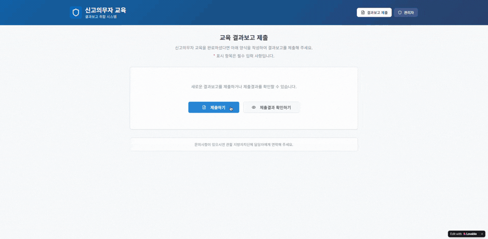  
- <strong>시청(보건소)</strong>은 실시간으로 교육 결과 제출 현황을 확인하고, 상태값을 변경할 수 있습니다.
 

***

## 🤖 기능 설명
### 🩺 의료기관
기관정보 및 교육 결과를 입력하고, 결과 보고를 조회하거나 수정할 수 있습니다.  

**🧑‍⚕️ 기관정보 입력** 
교육 결과를 입력하기 전 기관정보를 입력합니다.
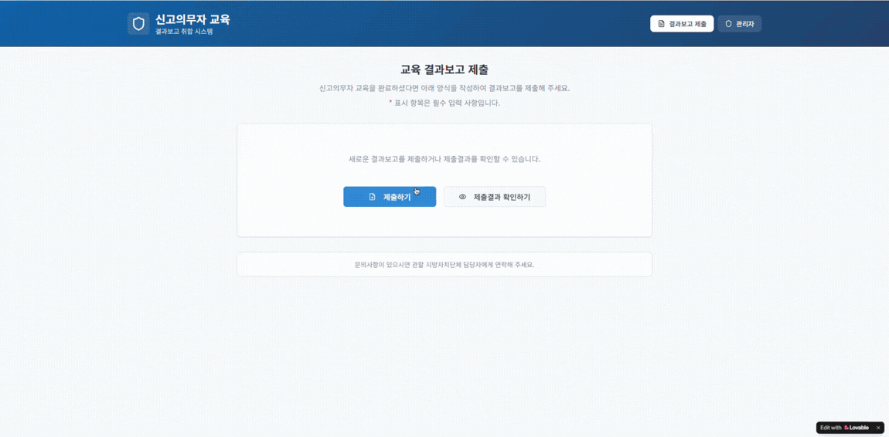  
**💊 교육 결과 입력** 
아동학대 → 장애인학대 → 긴급복지 → 노인학대 순으로 교육 결과를 입력합니다. 
- 아동학대
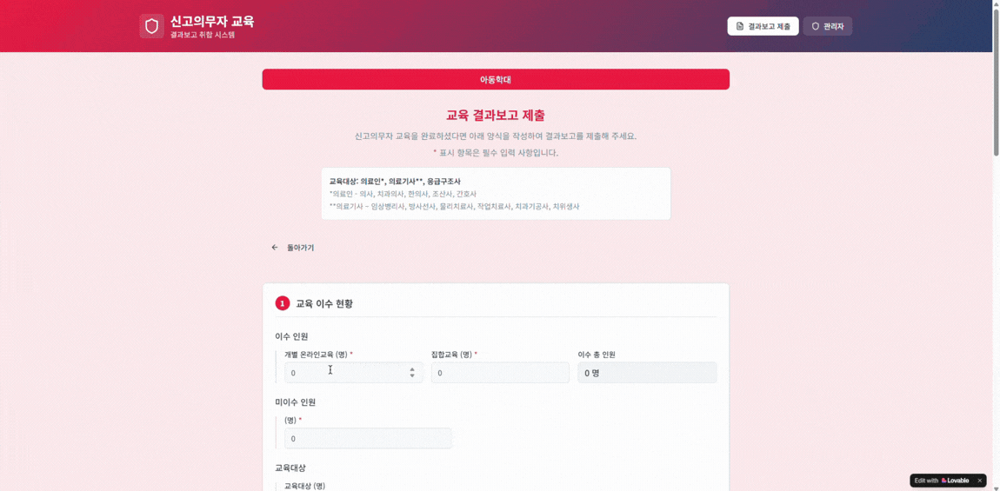  
- 장애인학대
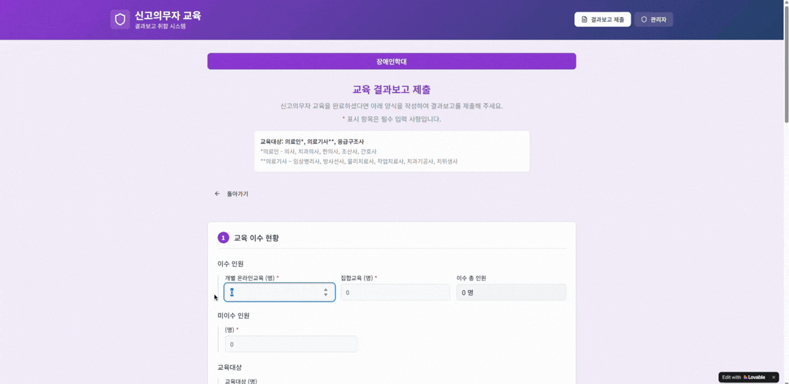  
- 긴급복지
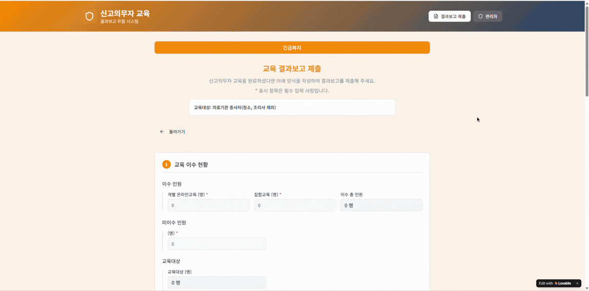  
- 노인학대(요양병원, 종합병원 급만 입력하는 교육)
 (노인학대 교육 대상이 아닌 경우 닫기 클릭)
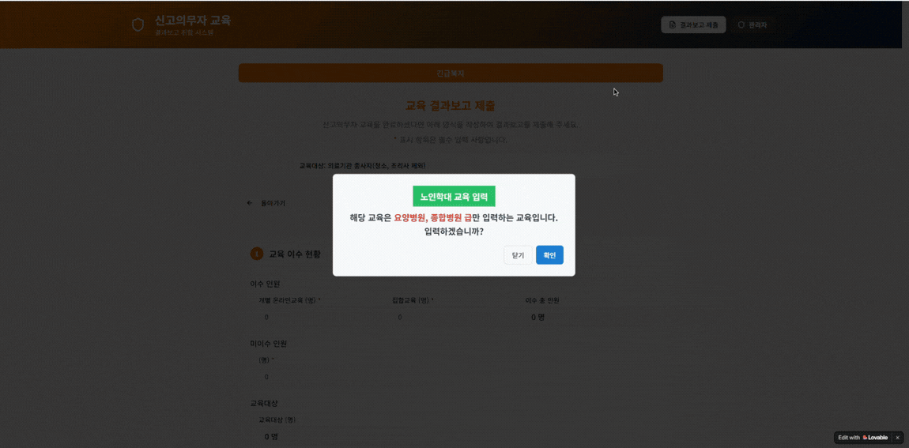   

**🖊️ 서명 후 제출** 
모든 교육 결과를 입력한 후 전자서명을 합니다. 
노인학대 교육 입력 대상이 아닌 경우 긴급복지 교육 결과 입력 후 전자서명을 합니다.
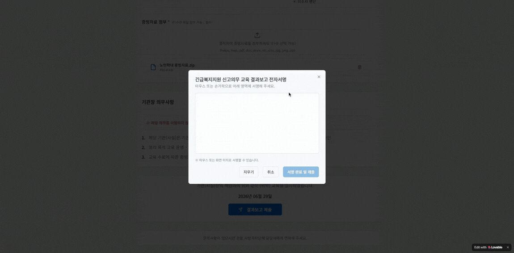   

**👀 제출 정보 조회** 
의료기관에서는 교육 결과의 제출 정보와 상태값(제출완료, 보완 필요, 확인)을 조회할 수 있습니다.
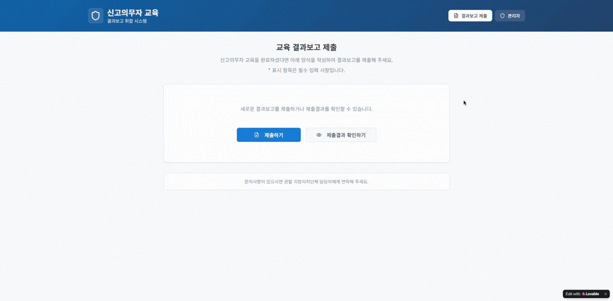  
**🖋️ 제출 정보 수정** 
보완 필요의 교육 결과의 경우, 사유를 확인하고 수정하여 재제출이 가능합니다. 
제출하지 못한 교육 또한 신규 제출이 가능합니다.
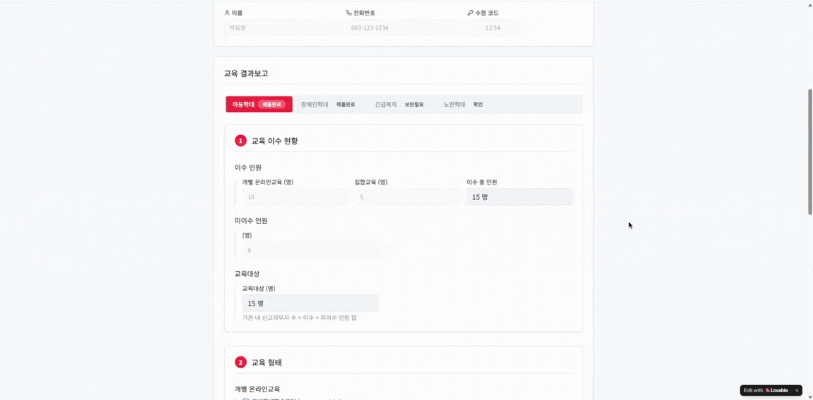  

***

### 🏥 시청(보건소)
실시간으로 교육 결과 제출 현황을 확인하고, 정보를 수정하거나 상태값을 변경할 수 있습니다.  

**💉 제출 현황 확인** 
시청(보건소)에서는 실시간으로 의료기관에서 제출한 교육 결과를 확인할 수 있습니다.
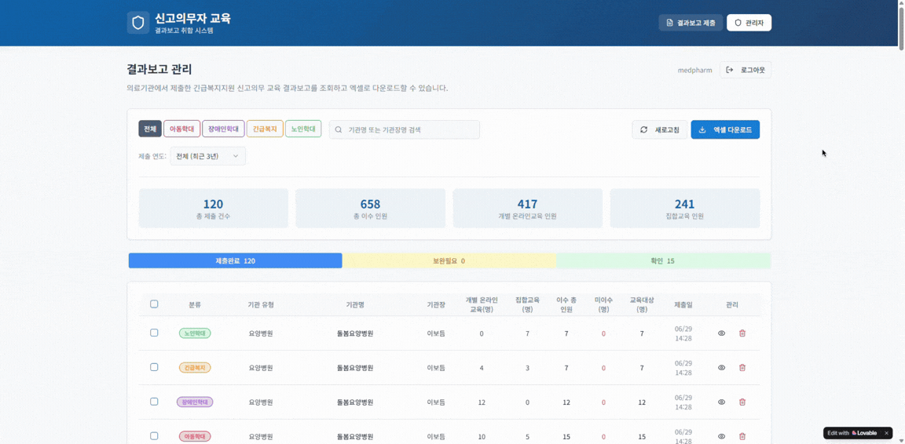  
**📝 정보 수정** 
잘못 기입된 정보가 있을 경우 임의로 수정할 수 있습니다.
  
**🎭 상태값 변경** 
의료기관에서 제출한 교육 결과를 조회 후 상태값(제출완료, 보완 필요, 확인)을 변경할 수 있습니다. 
보완 필요의 경우 사유를 입력할 수 있습니다.
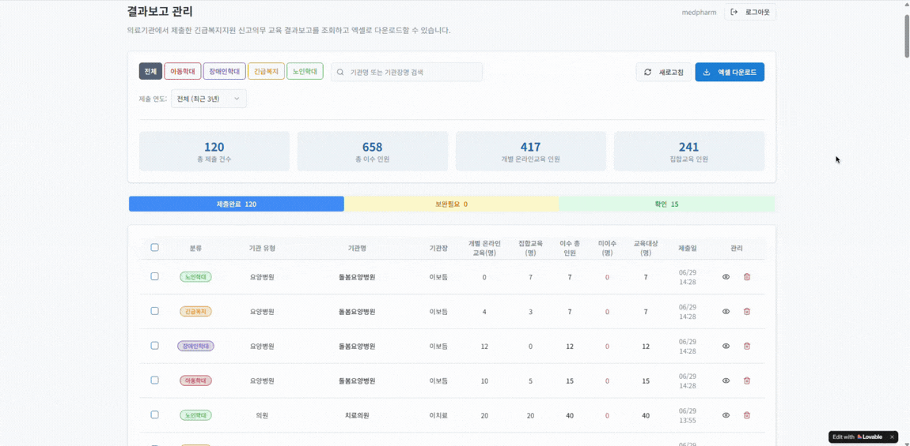  
**🙆 재제출 확인** 
보완 필요의 교육 결과를 의료기관에서 수정 후 재제출한 경우 확인할 수 있습니다.
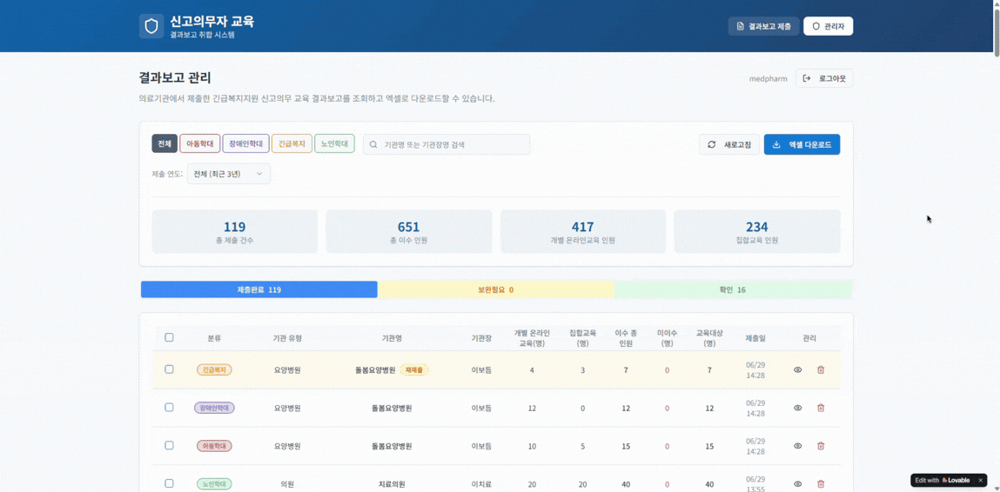  

